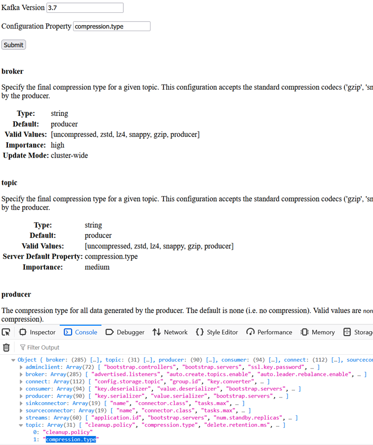

# Assignment of Configuration Parameters

## Goal
- Forward problem
  - Listig all Apache Kafka configuration properties and the associated "entities" (ex. <i>ssl.engine.factory.class - producer</i>)
- Inverse problem
  - Finding the list of "entities" associated with a given configuration property

## Expected Result

## Execution
- Local: Launch [config-param-assigner.html](./config-param-assigner.html)
- GitHub: [HTML Preview](https://htmlpreview.github.io/?https://github.com/nurlicht/Apache-Kafka-to-go/blob/main/tools/1.Doc_Search/config-param-assigner.html)
